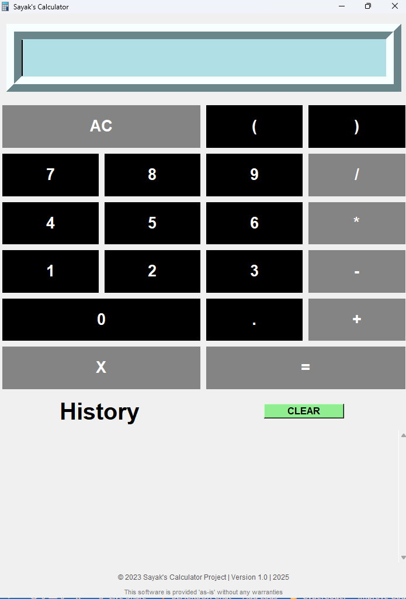

# Calculator Project (2023)



A Python-based calculator with advanced features, originally developed in 2023 and uploaded to GitHub in 2025.

## ✨ Features
- **Basic Operations**: +, -, ×, ÷
- **Advanced Functions**: Parentheses, backspace
- **Calculation History**: Scrollable record of past calculations
- **Clean UI**: Intuitive interface with color-coded buttons
- **Error Handling**: Clear messages for invalid inputs

## 📅 Project History
- **Originally Developed**: November 2023  
  _(Personal Python learning project)_
- **GitHub Upload**: January 2025  
  _(Added documentation and repository structure)_

## 🛠️ Technologies
- Python 3.x
- Tkinter (GUI)
- Pillow library (for icon support)
- Git (Version control)

## 🚀 Installation & Usage

```bash
# Clone the repository
git clone https://github.com/yourusername/calculator-project.git

# Navigate to project directory
pip install -r requirements.txt
cd calculator-project

# Run the calculator
python calculator.py
